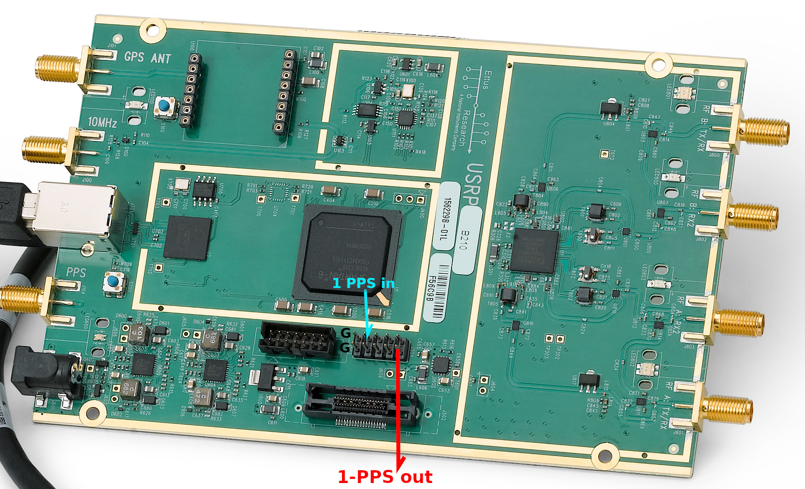

This fork of [gnss-sdr](https://github.com/oscimp/gnss-sdr) aims at 
providing spoofing detection capability by analyzing the direction of 
arrival of the signals transmitted from each GPS satellite transmitting 
in the L1 band and additionally 1-PPS output [0], as well as jamming detection
and cancellation capability by detecting strongly correlated signals detected
by multiple antennas. It is assumed that two antennas are connected to the 
two inputs of a dual channel coherent SDR receiver -- tests were completed with 
the Ettus Research B210 and Fairwaves XTRX -- separated by half a wavelength (10 cm at L1).

The original gnss-sdr installation documentation is found in [README.original](README.original).

This software was tested with an Ettus Research B210 dual-input SDR platform, with an
XTRX Osmocom source and with the File Source.

The Signal_Source philosophy is probably broken by including the spoofing detection
processing in [spoofing_detection](src/algorithms/signal_source/libs/spoofing_detection.cc). 
This solves the issue of multiple antenna-inputs and single output.

## Compiling

Rather than copying the whole gnss-sdr source tree and updating a few files, we have created
patches (April 2025) and clone a given hash of the gnss-sdr source code (set to version 0.0.20
as of April 2025) to which patches are to be applied. After 
```shell
git clone --recursive https://github.com/oscimp/gnss-sdr-1pps
```
we apply the patches with
```shell
cd gnss-sdr
for i in ../0*v0.0.20*patch; do patch -p1 < $i;done
```
The authors of gnss-sdr have de-activated again logging in 0.13 (see https://gnss-sdr.org/gnss-sdr-v0013-released/) so
compiling gnss-sdr with logging requires enabling the cmake flag ``-DENABLE_LOG=ON``. This command is applicable to
post-v0.0.18 gnss-sdr while the non-v0.0.18 patches were generated against pre-0.0.18 versions of gnss-sdr and are provided
for reference.

Most basic compilation (activating logging and Osmosdr support for the XTRX embedded board):
```shell
cd build
cmake -DENABLE_LOG=ON -DENABLE_OSMOSDR=ON ../
make -j4
```

For compiling ``gnss-sdr`` for Raspberry Pi 4 out of a Buildroot environment, use
```
cmake -DCMAKE_TOOLCHAIN_FILE=/directory/to/buildroot_RaspberryPi4/output/host/usr/share/buildroot/toolchainfile.cmake -DENABLE_LOG=ON ../
```
Since gnss-sdr requires many dependencies, a Buildroot ``defconfig`` configuration file for the Compute Module 4 (CM4) ie
provided as ``buildroot2024.11.1_defconfig`` (tested in Feb. 2025 with Buildroot 2024.11.1): run ``make buildroot2024.11.1_defconfig`` from
the Buildroot directory to apply these settings, and ``make`` to build the cross-compilation environment. For running only the spoofing
and jamming detection features, apply patches 1 to 3 but avoid path 4 which requires a VXI11 communication library. The FFT API was updated
to match GNU Radio 3.10 (Feb. 2025).

The default CPU policy for Buildroot is powersaving where the Raspberry Pi 4 CPUs run at 600 MHz. Please switch to ``ondemand``
or ``performance`` to switch the CPU to 1500 MHz speed using
```
echo "performance" > /sys/devices/system/cpu/cpu0/cpufreq/scaling_governor
```
Also, remember to run ``volk_profile`` on the target computer running gnss-sdr for best performance of VOLK (e.g. using the NEON
SIMD instructions on ARM). In all cases it is assumed that the GNU Radio version linked against is at least 3.8.

Support for VXI11 communication (used for communicating with a R&S SMA100A synthesizer for controlling
the B210 reference clock) can be disabled using ``cmake -DVXI11=FALSE ../``

## Synthesizing a new FPGA bitstream

Generating the 1-PPS output requires that the FPGA is configured with a custom bitstream. The patch
``b200-pps-uhd_67d783b.patch`` provided in the repository will implement such a functionality. In
order to synthesize the new bitstream: using ISE 14.7 (for the Spartan 6 FPGA of the B210 -- make sure to install the System Edition and *not* the Webpack Edition which will be missing the LX150 files even with a full license), run

```
# clone fpga repository
git clone https://github.com/EttusResearch/uhd
cd uhd/fpga/
# move to required commit
# git checkout 67d783b099826fb8a40deee0a7849b6d72bdcb2d
# apply PPS support patch
patch -p1 < /somewhere/gnss-sdr-1pps/b200-pps-uhd_67d783b.patch 
# build B210 bitstream (need to have ise in console PATH)
cd usrp3/top/b200/
make B210
```
with the output of the synthesis found in ``build/usrp_b210_fpga.bin`` to be copied in the ``UHD_IMAGES`` directory,
most probably ``/usr/share/uhd/images``. Possibly use ``uhd_image_loader --args="type=b200"`` to force loading the bitstream (which will be
updated anyway since libuhd will detect the inconsistency between the stored bitstream and the available bitstream).

Following this update, the 1-PPS output is generated on the following GPIO:



The feedback loop control assumes an external frequency synthesizer feeds the B210 with
a 10-MHz tunable output: at the moment only the Rohde & Schwarz SMA100A Signal Generator
(and others compatible) is supported, tuned to an output power of -6 dBm.


In the above chart, the red parts are for qualification purpose. The reference 1-PPS is derived from the
Hydrogen maser 10-MHz output feeding a custom, discrete TTL chips, counter.

## 1-PPS configuration

New configuration options have been implemented in the PVT processing module in charge of assessing the time offset between the local copy of the PRN codes and the received signal and controlling accordingly the B210 external clock source. These options are
```
PVT.PPS_correction=true
PVT.PPS_estimator_selected=false
PVT.PPS_Kp=15000
PVT.PPS_Ki=5000
PVT.LO_external_frequ=10000000
PVT.IP_SMA_address=192.168.1.69
PVT.SMA_internal_source_clock=true; default:true: Internal 10 MHz , false: External 10 MHz
```
with ``PPS_correction`` activating the output control (otherwise the 1-PPS is free running in the FPGA), ``PPS_estimator`` the use of an estimator prior to the PI control loop, ``PPS_Kp`` and ``PPS_Ki`` respectively the proportional and integral coefficient of the PI loop. Additionnally, ``LO_external_freq`` is the initial frequency setting of the Rohde & Schwarz SMA100A whose IP address is defined with ``IP_SMA_address``. Finally, the clock source of the SMA100A is defined with ``SMA_internal_source_clock`` with false being the external source, in our case a hydrogen maser output used as reference signal.

At a low level, the communication between the UHD library on the CPU and the FPGA registers is as follows, diverting these registers from their original GPIO control functions:
* RX for controlling the tag introduced on the IQ stream when the internal FPGA 1-PPS is triggered
* TX and DDR (both 16 bits to create a 32-bit value -- TX MSB and DDR LSB) are set sequentially in this order to define
the top value of the counter and hence shift the 1-PPS position. The top value is only set for 1 period before returning to the clock rate of 40E6.

## Spoofing detection and cancellation

The two sources for which configuration options have been added are ``File Source`` and ``UHD Source``
aimed at the B210 (two coherent input channels).

For the file source: the base filename is provided and we assume that two files exist, ``base_1.bin``
and ``base_2.bin``. Hence, the new argument
```
SignalSource.spoofing_protection=2
```
will change the behaviour of the ``SignalSource.filename`` option by appending ``_1.bin`` and
``_2.bin``. The only processing block available in this case is the spoofing detection and 
cancellation.

For the UHD source: ``SignalSource.spoofing_protection=N`` will activate ``N`` channels. Since
we aim at the B210, at the moment only ``N=2`` is supported since we explicitly state that
the channels are A:A and A:B meaning the two RX2 inputs. Spoofing protection expects a disturbing
signal with a BPSK structure. Alternatively, for noise detection and cancellation (no
assumption on the disturbing signal structure), a Stochastic Descent Gradient Approach (SGD) has
been implemented. This is activated with ``SignalSource.sgd=N``, with only ``N=2`` supported
as well, and is exclusive to ``spoofing_protection`` (either ``spoofing_protection`` **or** ``sgd``,
but not both).

Optional arguments to the Spoofing cancellation block are the phase standard deviation threshold to identify whether
spoofing is occurring, and the sliding average length. These parameters are tuned from the configuration file with
```
SignalSource.spoofing_averages=1
SignalSource.spoofing_threshold=0.05
```

Running ``gnss-sdr`` for testing spoofing cancellation on a file source is achieved with
```shell
./src/main/gnss-sdr -c ../File-GNSS-SDR-receiver.conf
```
assuming the ``File-GNSS-SDR-receiver.conf`` has been updated to point to an existing
pair of files recorded e.g. from a B210 as a spoofing signal was being emitted. The
File Source format is to provide directory + beginning of the file name and the
extension "_1.bin" and "_2.bin" will be added when loading the files. In this example,
the files are
```shell
$ ls -l /t/7_m35dBm/
-rw-r--r-- 1 xxx xxx 1964160000 Jun  5 17:23 7_m35dBm_1.bin
-rw-r--r-- 1 xxx xxx 1964160000 Jun  5 17:24 7_m35dBm_2.bin
```

Running the spoofing detection mechanism from ``gnss-sdr`` on these files will display
```shell
10:     meanarg=0.6722  meanabs=8.122   stdargres_=0.00061      weightabs=8.09,weightarg=0.68 /!\
```
with stdargres_=0.00061 meaning spoofing is occuring (the standard deviation on the angle
of arrival is too low to be compatible with a genuine constellation). The threshold detection
indicating spoofing was triggered with the /!\ sign at the end of the line.

On a genuine constellation,
```shell
13:     meanarg=-0.2871 meanabs=7.054   stdargres_=3.39117      weightabs=0.00,weightarg=0.00
```
indicates, through its large stdargres_ value, that no spoofing is occuring. Under such conditions,
decoding is performed as would be done with a classical gnss analysis sequence
```shell
8:      meanarg=-0.5817 meanabs=6.539   stdargres_=3.87295      weightabs=0.00,weightarg=0.00
New GPS NAV message received in channel 0: subframe 3 from satellite GPS PRN 01 (Block IIF)
New GPS NAV message received in channel 17: subframe 3 from satellite GPS PRN 22 (Block IIR)
New GPS NAV message received in channel 19: subframe 3 from satellite GPS PRN 14 (Block IIR)
New GPS NAV message received in channel 10: subframe 3 from satellite GPS PRN 17 (Block IIR-M)
New GPS NAV message received in channel 12: subframe 3 from satellite GPS PRN 32 (Block IIF)
New GPS NAV message received in channel 9: subframe 3 from satellite GPS PRN 28 (Block IIR)
First position fix at 2019-Nov-26 07:58:00.120000 UTC is Lat = 47.2534 [deg], Long = 5.99282 [deg], Height= 540.828 [m]
7:      meanarg=-0.3519 meanabs=7.124   stdargres_=3.90482      weightabs=0.00,weightarg=0.00
Position at 2019-Nov-26 07:58:00.500000 UTC using 4 observations is Lat = 47.254877320 [deg], Long = 5.994379292 [deg], Height = 885.775 [m]
Velocity: East: -0.045 [m/s], North: 0.182 [m/s], Up = 0.434 [m/s]
```

A graphical representation of this result is shown of the figure below


where a genuine record was collected (top=Doppler shift of the detected satellite, middle=phase
between antennas, bottom=position) initially (left), then with a spoofing signal generating
a location West of France in Britanny (Brest) for 6 minutes, before returning to the genuine 
signal, and finally genuine signal decoding (right) of the correct location in Besancon (East of
France).

This same sequence was repeated with real time cancellation of a static poofing source as 
illustrated below:

1/ despite spoofing by the PlutoSDR with a signal attenuated by 40 dB, the correct
position (47N, E) is decoded with SV identifiers from the genuine constellation (03,
14, 19 ans 22) none of which is part of the spoofing signal.


2/ if spoofing cancellation is de-activated, under the exact same conditions, the erroneous
position (48N, 4W) is decoded.


3/ Similarly, if the spoofing source is deactivated, the genuine position
is detected, as expected from the GNSS receiver.


See 
[1] and [2] for an explanation on the analaysis of the standard deviation of the phase between
antennas.

## Jamming cancellation

Jamming cancellation cannot rely on the BPSK structure of the spoofing signal. Hence a more
generic technique for identifying the copy of the signal found on one antenna to cancel its contribution
on the second antenna is needed. The Stochastic Gradient Descent (SGD) has been identified as
a computationally efficient way of achieving this result.

Activating the SGD jamming cancellation is achieved with ``SignalSource.sgd=2`` (the argument
2 meaning two antennas, which is the only supported value at the moment) for using the SGD algorithm,
or ``SignalSource.jamming_protection=2`` for activating the Inverse Filtering Method. Both these options
can only be selected when using the UHD signal source. 

``sgd`` accepts many parameters, all of which can be tuned from the configuration file. 
* ``SignalSource.sgd_mean=true`` means that the weight calculated from the SGD is subject to a sliding average,
improving the algorithm stability
* ``SignalSource.sgd_mean_length=1000`` indicates the sliding average length, a tradeoff between stabilization and
dynamic response to varying jamming sources
* ``SignalSource.sgd_iter_count=10000`` indicates how often the weighting is reset. The contribution of the correction
to the weight decreases as the square root of the iteration number and is periodically reset to fully correct
the current coefficient value. This variable tells how often the reset occurs.
* ``SignalSource.sgd_alpha=1.0`` is the weight correction factor (learning rate). The smaller the value, the slower the convergence, but too
high a value will lead to instability of the algorithm.

``jamming_protection`` accepts fewer parameters:
* ``SignalSource.jamming_threshold`` is the threshold on the magnitude of the weight defining whether jamming is occuring or not. The Inverse
Filtering weight can be thought of as a correlation factor, except that instead of FFT(antenna1)xCC(FFT(antenna2)) we compute
FFT(antenna1)/FFT(antenna2) to consider the ratio of the magnitudes instead of the product
* ``SignalSource.jamming_averages`` is the number of averages accumulated before updating the weight.

As a demonstration of the efficiency, genuine constellation - jamming - rotating the array by 90 degrees
while jamming - back to original position with jammin - genuine constellation is illustrated in the
following figure:


[0] D. Rabus, G. Goavec-Merou, G. Cabodevila, F. Meyer, J.-M Friedt, Generating A Timing Information (1-PPS) 
From A Software Defined Radio Decoding of GPS Signals, Joint Conference of the European Frequency and Time 
Forum and IEEE International Frequency Control Symposium (EFTF/IFCS), 2021 at 
https://ieeexplore.ieee.org/document/9604249

[1] J.-M. Friedt, W. Feng
Anti-leurrage et anti-brouillage de GPS par réseau d'antennes, MISC 110 (2020) [in French]

[2] J.-M. Friedt, W. Feng, G. Goavec-Merou, F. Meyer, GPS spoofing implementation by Software Defined 
Radio and computationally efficient GPS spoofing detection and cancellation, IEEE Aerospace and Electronic 
Systems Magazine **36** (3), 36--52 (March 2021) at https://ieeexplore.ieee.org/document/9374670

[3] J.-M Friedt, D. Rabus, G. Goavec-Merou, Software defined radio based Global Navigation Satellite 
System real time spoofing detection and cancellation, GNU Radio Conference 2020 with the video of the
oral presentation at http://jmfriedt.free.fr/grcon2020_jmfriedt_gps.mp4 and the slides at
http://jmfriedt.free.fr/grcon2020_gps.pdf
